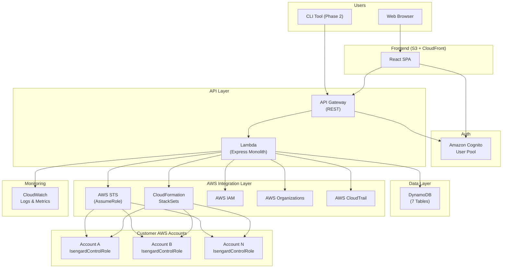
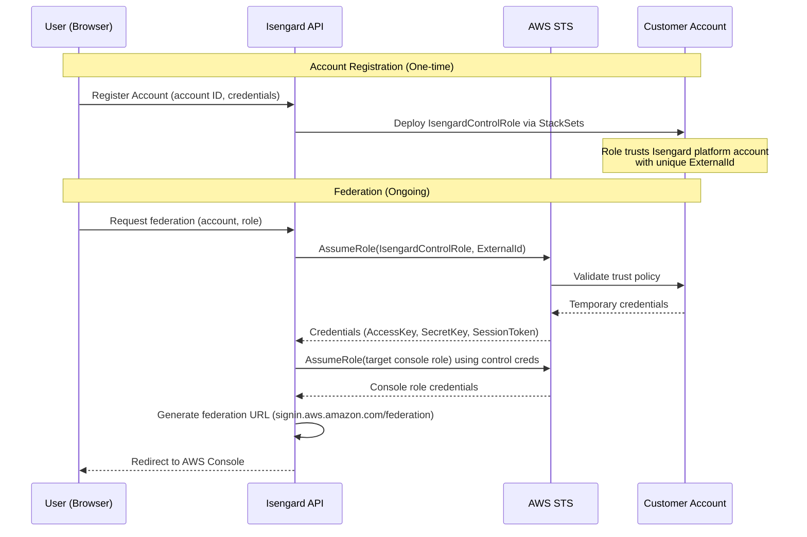
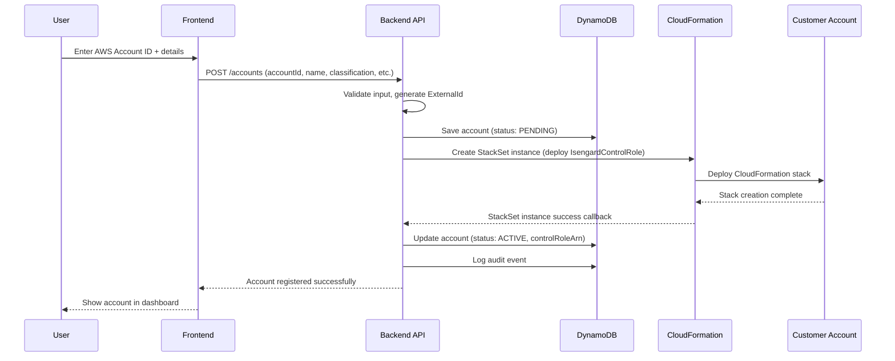
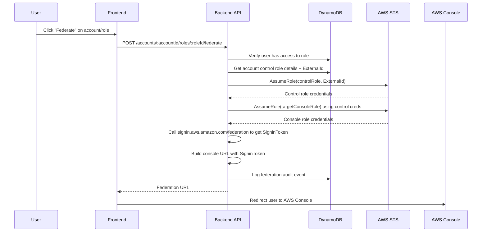

# Isengard — Architecture

## System Overview

Isengard is a SaaS platform that enables teams to manage, govern, and securely access multiple AWS accounts from a single interface. The platform uses a cross-account IAM role model to interact with registered AWS accounts, providing federation, role management, and security auditing.

### High-Level Architecture Diagram



---

## Component Breakdown

### 1. Frontend (React SPA)

**Responsibility**: User interface for all account management, federation, and governance features.

- **Technology**: React 18 + TypeScript + Vite + MUI
- **Hosting**: S3 with CloudFront (OAC, no direct public access)
- **State Management**: Zustand for global state
- **Data Fetching**: TanStack Query for server state
- **Auth**: Cognito integration via AWS Amplify Auth or custom hooks
- **i18n**: react-i18next (English, Spanish, RTL support)

**Key Pages**:
| Page | Description |
|------|-------------|
| Login/Register | Cognito auth flow |
| Dashboard | Account overview, recent activity, violations summary |
| Console Access | List of accounts/roles with one-click federation |
| Manage Accounts | Account list with search, filter, grouping |
| Account Detail | View/edit account metadata, classification, ownership |
| Account Roles | Console roles, application roles, policy management |
| Account History | Audit log for specific account |
| Groups | Team/group management and membership |
| Settings | User profile, preferences |

### 2. Backend (Express on Lambda)

**Responsibility**: API layer handling all business logic, AWS interactions, and data persistence.

- **Technology**: Node.js + Express + TypeScript
- **Compute**: Single Lambda function (monolith) behind API Gateway
- **Validation**: Joi for request validation
- **Auth Middleware**: Cognito JWT verification

**Key Modules**:
| Module | Responsibility |
|--------|---------------|
| Accounts Controller | CRUD operations, classification, onboarding |
| Roles Controller | Console/app role management, policy attachments |
| Federation Controller | STS AssumeRole, console URL generation, temp credentials |
| Groups Controller | Team/group CRUD, membership management |
| Ownership Controller | Primary/secondary owner management |
| Audit Controller | Action logging, history retrieval |
| Violations Controller | Security scan results, acknowledgement |
| Onboarding Service | CloudFormation StackSet deployment for control roles |

### 3. Authentication (Amazon Cognito)

**Responsibility**: User identity management, JWT token issuance.

- User Pool with email-based signup
- JWT tokens for API authentication
- Password policies, MFA support
- Custom attributes for organization/tenant mapping

### 4. Database (DynamoDB)

**Responsibility**: All persistent data storage.

See [DynamoDB Table Design](#dynamodb-table-design) below.

### 5. AWS Integration Layer

**Responsibility**: Cross-account operations on customer AWS accounts.

| Service                      | Usage                                                       |
| ---------------------------- | ----------------------------------------------------------- |
| **STS**                      | `AssumeRole` for federation and temporary credentials       |
| **CloudFormation StackSets** | Deploy control roles into customer accounts automatically   |
| **IAM**                      | Role/policy management within customer accounts             |
| **Organizations**            | Account discovery, OU hierarchy (Phase 2: account creation) |
| **CloudTrail**               | Correlation of federation events with account activity      |

### 6. Monitoring (CloudWatch)

**Responsibility**: Operational visibility.

- Lambda function logs
- API Gateway access logs
- Custom metrics (federation count, account registrations, violations)
- Alarms for error rates and latency

---

## Cross-Account Access Model

This is the core of how Isengard interacts with customer AWS accounts, mirroring the real Isengard's approach.

### Control Role Architecture



### Control Role Trust Policy

Each registered account gets an `IsengardControlRole` with this trust policy:

```json
{
  "Version": "2012-10-17",
  "Statement": [
    {
      "Effect": "Allow",
      "Principal": {
        "AWS": "arn:aws:iam::ISENGARD_PLATFORM_ACCOUNT:root"
      },
      "Action": "sts:AssumeRole",
      "Condition": {
        "StringEquals": {
          "sts:ExternalId": "IsengardExternalId-UNIQUE_PER_ACCOUNT"
        }
      }
    }
  ]
}
```

### Console Role Trust Policy

Console roles created by Isengard trust the control role:

```json
{
  "Version": "2012-10-17",
  "Statement": [
    {
      "Effect": "Allow",
      "Principal": {
        "AWS": "arn:aws:iam::CUSTOMER_ACCOUNT_ID:role/IsengardControlRole"
      },
      "Action": "sts:AssumeRole"
    }
  ]
}
```

---

## DynamoDB Table Design

### Table 1: Accounts

Stores all registered AWS account metadata.

| Attribute           | Type | Description                                             |
| ------------------- | ---- | ------------------------------------------------------- |
| `pk`                | S    | `ORG#<orgId>`                                           |
| `sk`                | S    | `ACCOUNT#<accountId>`                                   |
| `accountId`         | S    | AWS Account ID (12-digit)                               |
| `accountName`       | S    | Human-readable name                                     |
| `email`             | S    | Account email address                                   |
| `description`       | S    | Account description (min 20 chars)                      |
| `accountType`       | S    | `PERSONAL` or `SERVICE`                                 |
| `classification`    | S    | `PRODUCTION` or `NON_PRODUCTION`                        |
| `dataSensitivity`   | M    | `{ customerData, customerMetadata, businessData }`      |
| `primaryOwnerId`    | S    | User ID of primary owner                                |
| `secondaryOwnerIds` | L    | List of secondary owner user IDs                        |
| `groupOwnerId`      | S    | Group ID for team ownership                             |
| `externalId`        | S    | Unique external ID for STS trust                        |
| `controlRoleArn`    | S    | ARN of the IsengardControlRole                          |
| `controlRoleStatus` | S    | `PENDING`, `ACTIVE`, `FAILED`                           |
| `status`            | S    | `ACTIVE`, `SUSPENDED`                                   |
| `groupId`           | S    | Account group/folder ID                                 |
| `tags`              | M    | Custom key-value tags                                   |
| `createdAt`         | S    | ISO 8601 timestamp                                      |
| `updatedAt`         | S    | ISO 8601 timestamp                                      |
| `gsi1pk`            | S    | `OWNER#<userId>` (for querying accounts by owner)       |
| `gsi1sk`            | S    | `ACCOUNT#<accountId>`                                   |
| `gsi2pk`            | S    | `ACCOUNT_ID#<accountId>` (for lookup by AWS account ID) |
| `gsi2sk`            | S    | `ORG#<orgId>`                                           |

**GSIs**:

- **GSI1**: `gsi1pk` / `gsi1sk` — Query accounts by owner
- **GSI2**: `gsi2pk` / `gsi2sk` — Lookup account by AWS account ID

### Table 2: Roles

Stores IAM roles managed by Isengard per account.

| Attribute           | Type | Description                                    |
| ------------------- | ---- | ---------------------------------------------- |
| `pk`                | S    | `ACCOUNT#<accountId>`                          |
| `sk`                | S    | `ROLE#<roleId>`                                |
| `roleId`            | S    | UUID                                           |
| `roleName`          | S    | IAM role name                                  |
| `roleType`          | S    | `CONSOLE`, `APPLICATION`, `DELEGATED`          |
| `roleArn`           | S    | Full IAM role ARN                              |
| `description`       | S    | Role description                               |
| `policyArns`        | L    | List of attached policy ARNs                   |
| `policyTemplateIds` | L    | List of Isengard policy template IDs           |
| `allowedUsers`      | L    | User IDs with access                           |
| `allowedGroups`     | L    | Group IDs with access                          |
| `sessionTimeout`    | N    | Max session duration in seconds (default 3600) |
| `externalId`        | S    | External ID for this role's trust              |
| `status`            | S    | `ACTIVE`, `ORPHANED`, `DELETED`                |
| `createdAt`         | S    | ISO 8601 timestamp                             |
| `updatedAt`         | S    | ISO 8601 timestamp                             |
| `gsi1pk`            | S    | `ACCOUNT#<accountId>#TYPE#<roleType>`          |
| `gsi1sk`            | S    | `ROLE#<roleName>`                              |

### Table 3: Users

Platform users (Cognito-linked).

| Attribute     | Type | Description                 |
| ------------- | ---- | --------------------------- |
| `pk`          | S    | `ORG#<orgId>`               |
| `sk`          | S    | `USER#<userId>`             |
| `userId`      | S    | Cognito sub / UUID          |
| `email`       | S    | User email                  |
| `firstName`   | S    | First name                  |
| `lastName`    | S    | Last name                   |
| `cognitoSub`  | S    | Cognito user pool sub       |
| `role`        | S    | `ADMIN`, `MEMBER`, `VIEWER` |
| `groupIds`    | L    | Groups the user belongs to  |
| `status`      | S    | `ACTIVE`, `INACTIVE`        |
| `lastLoginAt` | S    | ISO 8601 timestamp          |
| `createdAt`   | S    | ISO 8601 timestamp          |
| `gsi1pk`      | S    | `EMAIL#<email>`             |
| `gsi1sk`      | S    | `USER#<userId>`             |

### Table 4: Groups

Teams/groups for ownership and access control.

| Attribute     | Type | Description                                 |
| ------------- | ---- | ------------------------------------------- |
| `pk`          | S    | `ORG#<orgId>`                               |
| `sk`          | S    | `GROUP#<groupId>`                           |
| `groupId`     | S    | UUID                                        |
| `groupName`   | S    | Group name                                  |
| `description` | S    | Group description                           |
| `memberIds`   | L    | List of user IDs                            |
| `maxMembers`  | N    | Max members (default 64, matching Isengard) |
| `createdAt`   | S    | ISO 8601 timestamp                          |
| `updatedAt`   | S    | ISO 8601 timestamp                          |

### Table 5: AuditLog

Immutable log of all platform actions.

| Attribute      | Type | Description                                                            |
| -------------- | ---- | ---------------------------------------------------------------------- |
| `pk`           | S    | `ACCOUNT#<accountId>`                                                  |
| `sk`           | S    | `AUDIT#<timestamp>#<auditId>`                                          |
| `auditId`      | S    | UUID                                                                   |
| `action`       | S    | Action type (e.g., `FEDERATE`, `CREATE_ROLE`, `UPDATE_CLASSIFICATION`) |
| `actorId`      | S    | User ID who performed the action                                       |
| `actorEmail`   | S    | User email                                                             |
| `accountId`    | S    | Target AWS account ID                                                  |
| `resourceType` | S    | `ACCOUNT`, `ROLE`, `USER`, `GROUP`                                     |
| `resourceId`   | S    | ID of affected resource                                                |
| `details`      | M    | Action-specific details (JSON)                                         |
| `ipAddress`    | S    | Client IP                                                              |
| `userAgent`    | S    | Client user agent                                                      |
| `timestamp`    | S    | ISO 8601 timestamp                                                     |
| `gsi1pk`       | S    | `ACTOR#<actorId>`                                                      |
| `gsi1sk`       | S    | `AUDIT#<timestamp>`                                                    |

**GSI1**: Query audit logs by actor (user).

### Table 6: PolicyTemplates

Reusable IAM policy templates.

| Attribute        | Type | Description           |
| ---------------- | ---- | --------------------- |
| `pk`             | S    | `ORG#<orgId>`         |
| `sk`             | S    | `POLICY#<policyId>`   |
| `policyId`       | S    | UUID                  |
| `policyName`     | S    | Template name         |
| `description`    | S    | Template description  |
| `policyDocument` | S    | JSON policy document  |
| `isGlobal`       | BOOL | Available to all orgs |
| `version`        | N    | Version number        |
| `createdBy`      | S    | User ID               |
| `createdAt`      | S    | ISO 8601 timestamp    |
| `updatedAt`      | S    | ISO 8601 timestamp    |

### Table 7: Violations

Security violations detected per account.

| Attribute        | Type | Description                                                       |
| ---------------- | ---- | ----------------------------------------------------------------- |
| `pk`             | S    | `ACCOUNT#<accountId>`                                             |
| `sk`             | S    | `VIOLATION#<violationId>`                                         |
| `violationId`    | S    | UUID                                                              |
| `violationType`  | S    | `UNMANAGED_IAM_USER`, `ROOT_ACCESS_KEYS`, `S3_BPA_DISABLED`, etc. |
| `severity`       | S    | `CRITICAL`, `HIGH`, `MEDIUM`, `LOW`                               |
| `description`    | S    | Human-readable description                                        |
| `resourceArn`    | S    | ARN of the affected resource                                      |
| `status`         | S    | `OPEN`, `ACKNOWLEDGED`, `RESOLVED`                                |
| `detectedAt`     | S    | ISO 8601 timestamp                                                |
| `resolvedAt`     | S    | ISO 8601 timestamp (nullable)                                     |
| `acknowledgedBy` | S    | User ID (nullable)                                                |
| `gsi1pk`         | S    | `ORG#<orgId>#STATUS#<status>`                                     |
| `gsi1sk`         | S    | `SEVERITY#<severity>#<detectedAt>`                                |

---

## Data Flow

### Account Registration Flow



### Federation Flow



---

## Security Considerations

### Authentication & Authorization

- All API requests require valid Cognito JWT token
- Organization-level isolation (users can only see their org's accounts)
- Role-based access: `ADMIN`, `MEMBER`, `VIEWER`
- Per-account role access controlled by `allowedUsers` and `allowedGroups`

### Cross-Account Security

- Every account gets a unique `ExternalId` to prevent confused deputy attacks
- Control roles follow least-privilege (only permissions needed for Isengard operations)
- Console role session duration capped at configurable maximum
- All federation events are logged in audit trail

### Data Protection

- DynamoDB encryption at rest (AWS managed keys)
- HTTPS-only for all API communication
- S3 bucket versioning and encryption for frontend assets
- No sensitive credentials stored in DynamoDB (all temporary via STS)
- Cognito handles password hashing and token management

### Infrastructure Security

- Lambda runs in VPC for sensitive operations
- API Gateway throttling and rate limiting
- CloudFront with WAF for frontend protection
- IAM least-privilege roles for all Lambda functions
- CloudWatch alarms for anomalous activity

---

## Scalability Notes

- **DynamoDB**: Auto-scaling with on-demand capacity mode
- **Lambda**: Automatic scaling with concurrency limits
- **CloudFront**: Global CDN for frontend
- **Multi-tenant**: Organization-based partitioning in DynamoDB (pk starts with `ORG#`)
- **Pagination**: All list APIs support cursor-based pagination via DynamoDB `LastEvaluatedKey`
- **Eventual consistency**: Audit logs and violation scans are eventually consistent; federation is strongly consistent

---

## External Dependencies

| Dependency         | Purpose                       | Risk Mitigation                    |
| ------------------ | ----------------------------- | ---------------------------------- |
| AWS STS            | Federation & temp credentials | Core AWS service, highly available |
| AWS CloudFormation | Control role deployment       | Retry logic, manual fallback       |
| AWS IAM            | Role/policy management        | Idempotent operations              |
| AWS Organizations  | Account discovery             | Optional, graceful degradation     |
| Amazon Cognito     | User authentication           | Standard AWS auth service          |
| Amazon DynamoDB    | Data persistence              | Multi-AZ, point-in-time recovery   |
| AWS CloudTrail     | Activity correlation          | Optional enrichment                |

---

## Additional Documentation

- `API_SCHEMA.md` — Full API endpoint documentation
- `TOOLS_AND_TECH.md` — Technology stack details
- `DECISIONS.md` — Architecture Decision Records
- `ROADMAP.md` — Feature roadmap and milestones
